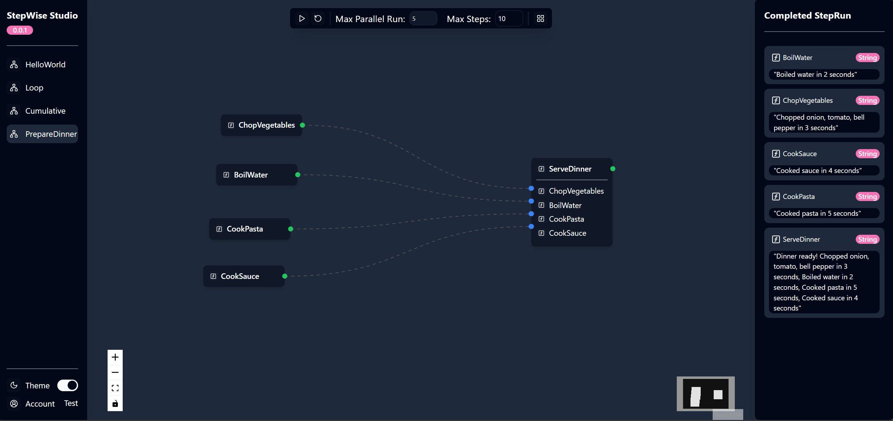

<a name="readme-top"></a>


<div align="center">


# StepWise


[](https://littlelittlecloud.github.io/StepWise/)
</div>

StepWise is a workflow engine build with C# and typescript. In StepWise, you define a workflow in C#, then visualize and execute it in StepWise UI.

## Demo
[demo](https://github.com/user-attachments/assets/c2cb7d68-ccc9-4457-87c1-7aeecbf9df3c)

## Quick Start

Here's a simple example of how to define a workflow to prepare dinner. The workflow consists of several steps, such as chopping vegetables, boiling water, cooking pasta, and cooking sauce. The final step is to serve dinner, which depends on all the previous steps. When executed, the workflow will automatically resolve the dependencies between steps and execute them in the parallel if possible.

```csharp
using StepWise;

public class PrepareDinner
{
    [Step]
    public async Task<string> ChopVegetables(string[] vegetables)
    {
        await Task.Delay(3000);

        return $"Chopped {string.Join(", ", vegetables)}";
    }

    [Step]
    public async Task<string> BoilWater()
    {
        await Task.Delay(2000);

        return "Boiled water";
    }

    [Step]
    public async Task<string> CookPasta()
    {
        await Task.Delay(5000);

        return "Cooked pasta";
    }

    [Step]
    public async Task<string> CookSauce()
    {
        await Task.Delay(4000);

        return "Cooked sauce";
    }

    [Step]
    [DependOn(nameof(ChopVegetables))]
    [DependOn(nameof(BoilWater))]
    [DependOn(nameof(CookPasta))]
    [DependOn(nameof(CookSauce))]
    public async Task<string> ServeDinner(
        [FromStep(nameof(ChopVegetables))] string[] vegetables,
        [FromStep(nameof(BoilWater))] string water,
        [FromStep(nameof(CookPasta))] string pasta,
        [FromStep(nameof(CookSauce))] string sauce)
    {
        return $"Dinner ready!";
    }
}

// Usage
var prepareDinner = new PrepareDinner();
var workflow = Workflow.CreateFromInstance(prepareDinner);
var engine = new WorkflowEngine(workflow, maxConcurrency: 10);
var stopwatch = System.Diagnostics.Stopwatch.StartNew();
var inputVariables = new Dictionary<string, object>
{
    [nameof(ChopVegetables)] = StepVariable.Create(new[] { "tomato", "onion", "garlic" }),
};

await foreach (var stepResult in engine.ExecuteAsync(nameof(ServeDinner), inputVariables))
{
    // print every step result
    // ChopVegetables: Chopped tomato, onion, garlic
    // BoilWater: Boiled water
    // CookPasta: Cooked pasta
    // CookSauce: Cooked sauce
    // ServeDinner: Dinner ready!
    Console.WriteLine(stepResult);
}

stopwatch.Stop();

// Because the steps are executed in parallel, the total time should be less than the sum of individual step times
stopwatch.ElapsedMilliseconds.Should().BeLessThan(6000);
```

## Visualize stepwise workflow

StepWise UI is a built-in WebUI for visualizing and executing workflows. To use StepWise UI, simply add the following code to your project:

```csharp
// program.cs
var host = Host.CreateDefaultBuilder()
    //.UseEnvironment("Development")
    .ConfigureWebHostDefaults(webBuilder =>
    {
        webBuilder.UseUrls("http://localhost:5123");
    })
    .UseStepWiseServer()
    .Build();

await host.StartAsync();
```

Then, use `StepWiseClient` to add workflows to StepWise UI:

```csharp
var stepWiseClient = host.Services.GetRequiredService<StepWiseClient>();

// Add the workflow to the StepWise server
stepWiseClient.AddWorkflow(prepareDinner);

// Wait for the host to shutdown
await host.WaitForShutdownAsync();
```

Now, you can visit `http://localhost:5123` to see the StepWise UI and execute the workflow.



## Examples
You can find more examples in the [examples](https://github.com/LittleLittleCloud/StepWise/tree/main/example) directory.

## Dependency Management between Steps
### Step Dependency
In StepWise, you can define dependencies between steps using the `[DependsOn]` attribute. This ensures that a step is executed only after its dependencies have been satisfied.

> [!Note]
> Prevent circular dependencies between steps, otherwise, the workflow engine will remind you with an exception.

### Variable Dependency
Variable dependencies of a step means that the step requires certain variables to be available in the context before it can be executed. If all variable dependencies are met, the step can be executed in parallel with other steps that don't have dependencies on it. In StepWise, variable dependencies are the input parameters of a step.

> [!Note]
> `[FromStep]` attribute doesn't affect the step dependency. It is used to pass the output of one step as input to another step.

StepWise automatically manages dependencies between Steps:
- Use the `[DependsOn]` attribute to specify dependencies between Steps.
- The StepwiseEngine resolves these dependencies and ensures Steps are executed in the correct order.

## Parallel Execution

StepWise supports parallel execution of steps that do not have step dependencies on each other. This can significantly improve the performance of your workflows by executing independent steps concurrently.

## `StepWiseEngine`
`StepWiseEngine` is the core component of StepWise that manages the execution of workflows. It uses a consumer-producer approach to execute steps in the correct order while handling dependencies between steps and parallel execution when possible. You can visit this [documentation](./article/DeepDiveToStepWiseEngine.md) to learn more about how the `StepWiseEngine` works.

## Primitives

StepWise is built around two main primitives:

### 1. Step

A Step is the smallest unit of work in StepWise. It represents a single task or operation within a workflow.

- **Definition**: A Step is essentially a C# method decorated with the `[Step]` attribute.
- **Properties**:
  - Name: A unique identifier for the step.
  - Input Parameters: The data required by the step to perform its task.
  - Output: The result produced by the step (if any). **Must be a Task or Task<\T>**.
  - Dependencies: Other steps that must be executed before this step. This is specified using the `[DependsOn]` attribute.
- **Usage**: 
  ```csharp
  [Step]
  [DependsOn(nameof(OtherStep))]
  [DependsOn(nameof(AnotherStep))]
  public Task<Data> GetData(int id)
  {
      // Implementation
  }
  ```

### 2. Workflow

A Workflow is a collection of Steps that together accomplish a larger task.

- **Definition**: A Workflow is typically represented by a class containing multiple Step methods.
- **Usage**: 
  ```csharp
  public class DataProcessingWorkflow
  {
      [Step(Name = "GetData")]
      public Task<Data> GetData(int id) { /* ... */ }

      [Step(Name = "ProcessData")]
      [DependsOn(nameof(GetData))]
      public Task<Result> ProcessData([FromStep("GetData")] Data data) { /* ... */ }

      [Step(Name = "SaveResult")]
        [DependsOn(nameof(ProcessData))]
      public Task<string> SaveResult([FromStep("ProcessData")] Result result) { /* ... */ }
  }
  ```

## Contributing

We welcome contributions to StepWise! Please see our [Contributing Guide](https://github.com/LittleLittleCloud/StepWise/tree/main/CONTRIBUTING.md) for more details.

## License

StepWise is released under the MIT License. See the [LICENSE](https://github.com/LittleLittleCloud/StepWise/tree/main/LICENSE) file for details.

## Support

If you encounter any issues or have questions, please file an issue on the GitHub issue tracker.
