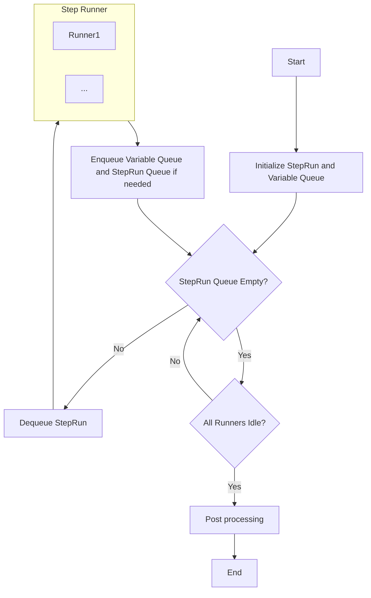
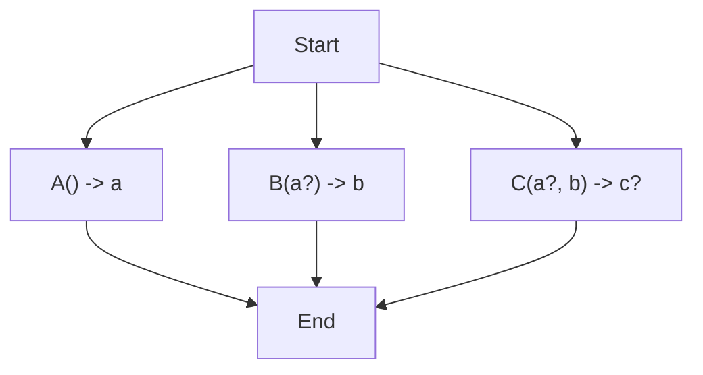
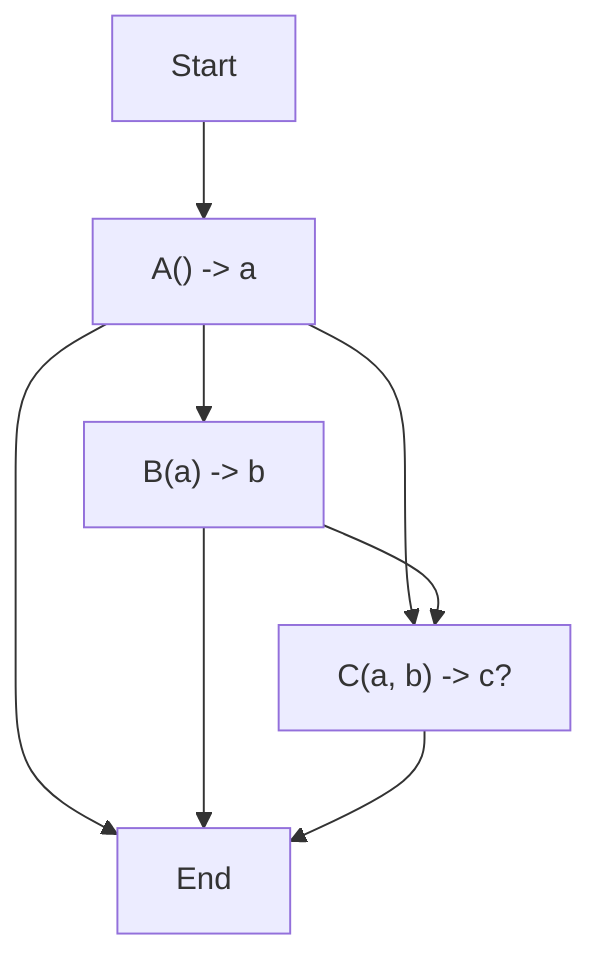
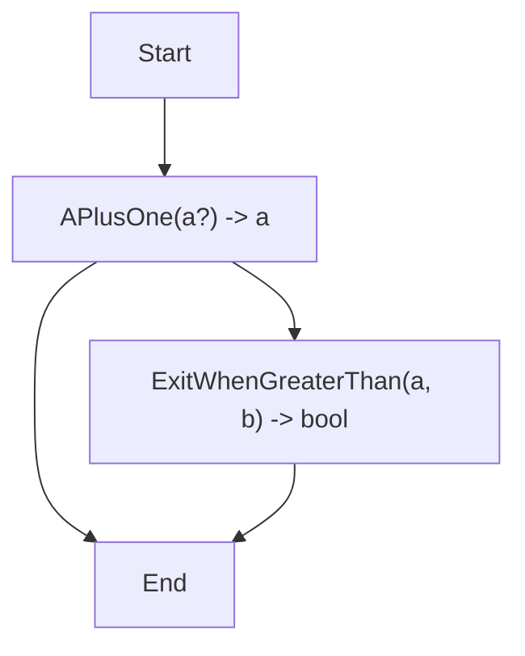

# Deep dive into `StepWiseEngine`

## Introduction
`StepWiseEngine` is the core component of the `StepWise` framework. It is responsible for managing and executing a series of steps `wisely`.

By wisely, it means that the `StepWiseEngine` can automatically resolve the dependencies between steps and execute them in parallel if possible. And execute the steps in the correct order if there are dependencies between them.

## Key Concept And Notion

Before we dive into the implementation details, let's first clarify some key concepts and notions. We will use these concepts and notions to express a stepwise workflow and its execution process throughout the rest of the document.

- `Variable`: Represented by small characters (e.g., `a`, `b`, `c`), variables are the basic units of data in the StepWiseEngine.
- `Step`: Denoted by capital letters, steps are operations that can accept variables as input and optionally return variables as output. Steps can have optional inputs, indicated by a question mark (e.g., `A(b?, c) -> a?`).
- `StepRun`: A step run is an instance of a step that is executed with specific input variables and version numbers. A step run is uniquely identified by the step name and the input variables and version numbers (e.g., `A_0(b_1, c_2) -> a_3`).
- `Context`: A collection that stores all variables along with their version numbers, tracking the evolution of data throughout the process (e.g., `[a_0, b_1, c_2, ...]`).
- `StepRun Queue`: An ordered list of steps to be executed, including their input variables and version numbers (e.g., `[A_0(), B_1(a_0), C_2(a_0, b_1), ...]`).
- `Variable Queue`: A list of variables that need to be updated in the context after executing a step (e.g., `[a_3, b_4, c_5, ...]`).

## Implementation Overview

<!-- create a short description of the consumer-producer pattern based on the diagram above -->

## Example
In this section, we will explore a few examples to illustrate how the `StepWiseEngine` works in practice.

### Parallel Steps
#### Steps
 - `A() -> a`: Step A takes no input and returns a variable `a`.
 - `B(a?) -> b`: Step B takes an optional input `a` and returns a variable `b`.
 - `C(a?, b) -> c?` : Step C takes an optional input `a` and a required input `b`, and returns an optional variable `c`.
#### Dependencies
In `StepWise`, there are two types of dependencies: variable dependency and step dependency. Variable dependency means that a step requires a variable to be available in the context to be executed. Step dependency means that a step requires another step to be executed before it can be executed. The two types of dependencies are treated differently in the `StepWiseEngine` because variable dependencies don't necessarily mean that the steps have dependencies on each other. If all variable dependencies are met in the context, the steps can still be executed in parallel.

In this example, despite the fact that `B` has variable dependency on the output of `A`, and `C` has variable dependencies on the outputs of `A` and `B`, they are not dependent on each other. Therefore, `B` and `C` can be executed in parallel after `a` is available in the context.

#### Initialize context
`{}`: An empty context.
#### Stop strategy
When `c` is available in the context.
#### Execution
| generation | Context | StepRun Queue | Explanation |
|-----------|---------------|----------------|-------------|
| 0 | `{}` | `[A_1(), B_1()` | `C` is not in the queue because it has an required input `b` that is not available. The version of `StepRun` will be `generation + 1` |
| 1 | `{a_1, b_1}` | `[B_2(a_1), C_2(a_1, b_1)` | `A` is executed and `a` is stored in the context. And it's not added back to the StepRun queue again because its input doesn't change. `B` and `C` are added to the queue because their inputs are available and updated|
| 2 | `{a_1, b_1, b_2, c_2}` | `stop` | `B` and `C` are executed and their outputs are stored in the context. The execution stops because `c` is available in the context. |

### Cumulative Steps
#### Steps
 - `A() -> a`: Step A takes no input and returns a variable `a`.
 - `B(a) -> b`: Step B takes an optional input `a` and returns a variable `b`.
 - `C(a, b) -> c?` : Step C takes an optional input `a` and a required input `b`, and returns an optional variable `c`.

#### Dependencies
`B` depends on `A`, and `C` depends on `A` and `B`.

#### Initialize context
`{}`: An empty context.

#### Stop strategy
When `c` is available in the context.

#### Execution
| generation | Context | StepRun Queue | Explanation |
|-----------|---------------|----------------|-------------|
| 0 | `{}` | `[A_1()` | `B` and `C` are not in the queue because they have dependencies on `A` which is not available. The version of `StepRun` will be `generation + 1` |
| 1 | `{a_1}` | `[B_2(a_1)]` | `A` is executed and `a` is stored in the context. B is added to the queue because its input is available and updated, C is not added because `b` is not available. |
| 2 | `{a_1, b_2}` | `[C_3(a_1, b_2)]` | `B` is executed and `b` is stored in the context. `C` is added to the queue because its inputs are available and updated. |
| 3 | `{a_1, b_2, c_3}` | `stop` | `C` is executed and `c` is stored in the context. The execution stops because `c` is available in the context. |

### Circular Variables Dependency
Circular step dependencies are not allowed in the `StepWiseEngine`. The engine will throw an exception if it detects a circular dependency. However, Circular variables dependencies are allowed, which means that the step can take its own output, or the output of steps that depend on it, as input.

The following example demonstrates how to use a circular variable to implement a `while` loop in the `StepWiseEngine`.

#### Steps
 - `APlusOne(a?) -> a`: Step APlusOne takes an optional `integer` input `a` and returns the value of `a + 1`. If `a` is not provided, the `APlusOne` step will return `1`.
 - `ExitWhenGreaterThan(a, b) -> bool`: Step ExitWhenGreaterThan takes two required `integer` inputs `a` and `b`. If `a` is greater than `b`, the step will return `true`, otherwise, it will return `false`.

#### Dependencies
`APlusOne` has circular variable dependency on itself, and `ExitWhenGreaterThan` depends on `APlusOne`.

#### Initialize context
`{b: 3}`: A context with a variable `b` set to `3`.

#### Stop strategy
When `ExitWhenGreaterThan` returns `true`.

#### Execution
| generation | Context | StepRun Queue | Explanation |
|-----------|---------------|----------------|-------------|
| 0 | `{b_0 = 3}` | `[APlusOne_1()` | `ExitWhenGreaterThan` is not in the queue because it has a dependency on `APlusOne` which is not available. The version of `StepRun` will be `generation + 1` |
| 1 | `{b_0 = 3, a_1 = 1}` | `[ExitWhenGreaterThan_2(a_1, b_0), APlusOne_2(a_1)]` | `APlusOne` is executed and `a` is stored in the context. `ExitWhenGreaterThan` is added to the queue because its inputs are available and updated. `APlusOne` is added to the queue because its input is available and updated. |
| 2 | `{b_0 = 3, a_1 = 1, a_2 = 2, bool_2 = false}` | `[ExitWhenGreaterThan_3(a_2, b_0), APlusOne_3(a_2)]` | `APlusOne` is executed and `a` is stored in the context. `ExitWhenGreaterThan` is added to the queue because its inputs are available and updated. `APlusOne` is added to the queue because its input is available and updated. |
| 3 | `{b_0 = 3, a_1 = 1, a_2 = 2, a_3 = 3, bool_3 = false}` | `[ExitWhenGreaterThan_4(a_3, b_0), APlusOne_4(a_3)]` | `APlusOne` is executed and `a` is stored in the context. `ExitWhenGreaterThan` is added to the queue because its inputs are available and updated. `APlusOne` is added to the queue because its input is available and updated. |
| 4 | `{b_0 = 3, a_1 = 1, a_2 = 2, a_3 = 3, a_4 = 4, bool_4 = true}` | `stop` | `APlusOne` is executed and `a` is stored in the context. `ExitWhenGreaterThan` is executed and `bool` is stored in the context. The execution stops because `ExitWhenGreaterThan` returns `true`. |
