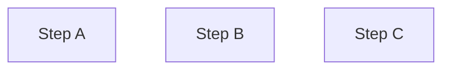

# Deep dive into `StepWiseEngine`

## Introduction
`StepWiseEngine` is the core component of the `StepWise` framework. It is responsible for managing and executing a series of steps `wisely`.

By wisely, it means that the `StepWiseEngine` can automatically resolve the dependencies between steps and execute them in parallel if possible. And execute the steps in the correct order if there are dependencies between them.

## Key Concept And Notion

Before we dive into the implementation details, let's first clarify some key concepts and notions. We will use these concepts and notions throughout the rest of the document.

- `Variable`: Represented by small characters (e.g., `a`, `b`, `c`), variables are the basic units of data in the StepWiseEngine.
- `Step`: Denoted by capital letters, steps are operations that can accept variables as input and optionally return variables as output. Steps can have optional inputs, indicated by a question mark (e.g., `A(b?, c) -> a?`).
- `StepRun`: A step run is an instance of a step that is executed with specific input variables and version numbers. A step run is uniquely identified by the step name and the input variables and version numbers (e.g., `A_0(b_1, c_2) -> a_3`).
- `Context`: A collection that stores all variables along with their version numbers, tracking the evolution of data throughout the process (e.g., `[a_0, b_1, c_2, ...]`).
- `StepRun Queue`: An ordered list of steps to be executed, including their input variables and version numbers (e.g., `[A_0(), B_1(a_0), C_2(a_0, b_1), ...]`).

## Implementation Overview
```mermaid
graph TD
    A[Start] --> B[Initialize Context]
    B --> C[Initialize StepRun Queue]
    B --> D[Initialize Variable Queue]
    C --> E{StepRun Queue Empty?}
    E -->|No| F[Dequeue StepRun]
    F --> G[Execute StepRun]
    G --> H[Enqueue Variable Queue]
    H --> E
    E -->|Yes| I{All Tasks Complete?}
    I -->|No| E
    I -->|Yes| J[Post processing]
    J --> K[End]

    subgraph "StepRun Queue"
    C1[`A_0()`] --> C2[`B_1(a_0)`] --> C3[`C_2(a_0, b_1)`]
    end

    subgraph "Variable Queue"
    D1[`a_0`] --> D2[`b_1`] --> D3[`c_2`]
    end

    G -.-> C1
    H -.-> D3
```

<!-- create a short description of the consumer-producer pattern based on the diagram above -->


## Example
In this section, we will explore a few examples to illustrate how the `StepWiseEngine` works in practice.

### Parallel Steps
#### Steps
 - `A() -> a`: Step A takes no input and returns a variable `a`.
 - `B(a?) -> b`: Step B takes an optional input `a` and returns a variable `b`.
 - `C(a?, b) -> c?` : Step C takes an optional input `a` and a required input `b`, and returns an optional variable `c`.
#### Dependencies
`A`, `B`, and `C` are independent steps that can be executed in parallel.

#### Initialize context
`{}`: An empty context.
#### Stop strategy
When `c` is available in the context.
#### Execution
| iteration | Context | StepRun Queue | Explanation |
|-----------|---------------|----------------|-------------|
| 0 | `{}` | `[A_1(), B_1()` | `C` is not in the queue because it has an required input `b` that is not available. The version of `StepRun` will be `iteration + 1` |
| 1 | `{a_1, b_1}` | `[B_2(a_1), C_2(a_1, b_1)` | `A` is executed and `a` is stored in the context. And it's not added back to the StepRun queue again because its input doesn't change. `B` and `C` are added to the queue because their inputs are available and updated|
| 2 | `{a_1, b_1, b_2, c_2}` | `stop` | `B` and `C` are executed and their outputs are stored in the context. The execution stops because `c` is available in the context. |