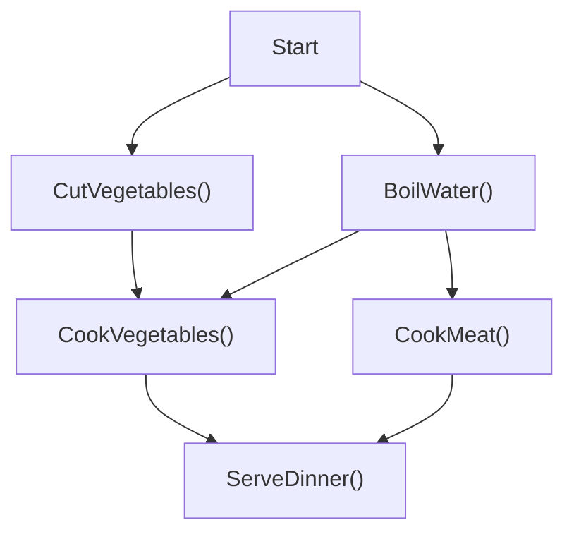

The following example shows how to create a stepwise workflow in C#. To better illustrate the concept, we will create a simple workflow that prepares dinner.

[!NOTE]
[You can try-out this workfow at [StepWise Live Demo](https://stepwisegallery20241128154731.azurewebsites.net/)]

## Prepare dinner overview
The dinner preparation workflow consists of the following steps:


[!Video https://www.youtube.com/embed/4UmGGQbTdmU?si=Zj6WrnW2b_oYq2-l]

Where we can notice that some steps can be executed in parallel, such as `CutVegetables()` and `BoilWater()`, and some steps depend on the previous steps, such as `CookVegetables()` and `CookMeat()`. When all the steps are completed, the `ServeDinner()` step can be executed. This dependency can be automatically resolved by the StepWise engine after the prepare dinner workflow is defined.

## Create a new StepWise project
To create a new StepWise project, you can use the StepWise template provided by StepWise. You can create a new StepWise project using the following command from dotnet-cli:

```bash
// install the StepWise template
dotnet new -i LittleLittleCloud.StepWise.Template

// create a new StepWise project
dotnet new stepwise-console -n PrepareDinnerProject
```

## Define workflow

In StepWise, every workflow is represented as a basic C# class and every steps under that workflow is mapping to a public async method with `Step` Attribution.

Therefore, we can start by defining a `PrepareDinner` class with the following steps:

```csharp
// file: PrepareDinner.cs
public class PrepareDinner
{
    // ...
}
```

Next, we can start adding the steps to the `PrepareDinner` class. We will add `Start` step first.

```csharp
// file: PrepareDinner.cs
public class PrepareDinner
{
    [Step]
    public async Task<DateTime> Start()
    {
        Console.WriteLine("Start preparing dinner at " + DateTime.Now);

        return DateTime.Now;
    }
}
```
The `Start` step is a simple step that prints the current time to the console and returns the current time. This step is the first step in the workflow and does not depend on any other steps.

One thing to note is the `Step` attribute on the `Start` method. This attribute tells the StepWise engine that this method is a step in the workflow.

Next, we can add `CutVegetables` and `BoilWaters` steps to the `PrepareDinner` class. These steps will depend on the `Start` step, which is marked by the `DependOn` attribute.

```csharp
// file: PrepareDinner.cs
public class PrepareDinner
{
    // ... previous steps
    
    [Step]
    [DependOn(nameof(Start))]
    public async Task<string> CutVegetables()
    {
        Console.WriteLine("Cutting vegetables...");
        await Task.Delay(2000);
        return "Vegetables are cut in 2 seconds";
    }

    [Step]
    [DependOn(nameof(Start))]
    public async Task<string> BoilWater()
    {
        Console.WriteLine("Boiling water...");
        await Task.Delay(3000);
        return "Water is boiled in 3 seconds";
    }
}
```

Next, we can add `CookVegetables` step. We want the `CookVegetables` step to depend on the `CutVegetables` step. This can be done by adding the `DependOn` attribute to the `CookVegetables` method. Other than the dependency, we also want to use the result of the `CutVegetables` step in the `CookVegetables` step. This can be done by adding the `FromStep` attribute to the `CookVegetables` method.

```csharp
// file: PrepareDinner.cs
public class PrepareDinner
{
    // ... previous steps

    [Step]
    [DependOn(nameof(CutVegetables))]
    [DependOn(nameof(BoilWater))]
    public async Task<string> CookVegetables(
        [FromStep(nameof(CutVegetables)) string cutVegetablesResult)
    {
        Console.WriteLine("Cooking vegetables...");
        await Task.Delay(3000);

        var result = $"Vegetables are cooked in 3 seconds. {cutVegetablesResult}";

        return result;
    }
}
```

Finally, we can add the `ServeDinner` step to the `PrepareDinner` class. This step will depend on the `CookVegetables` and `CookMeat` steps. We can add the `DependOn` attribute to the `ServeDinner` method to specify the dependencies. We also want to use the results of the `CookVegetables` and `CookMeat` steps in the `ServeDinner` step. This can be done by adding the `FromStep` attribute to the `ServeDinner` method.

```csharp
// file: PrepareDinner.cs
public class PrepareDinner
{
    // ... previous steps

    [Step]
    [DependOn(nameof(CookVegetables))]
    [DependOn(nameof(CookMeat))]
    public async Task<string> ServeDinner(
        [FromStep(nameof(CookVegetables)) string cookVegetablesResult,
        [FromStep(nameof(CookMeat)) string cookMeatResult)
    {
        Console.WriteLine("Serving dinner...");
        await Task.Delay(1000);

        var result = $"Dinner is served in 1 second. {cookVegetablesResult} {cookMeatResult}";

        return result;
    }
}
```

At this point, we have defined the `PrepareDinner` workflow with all the necessary steps. The workflow is ready to be executed.

## Add PrepareDinner workflow to StepWise server
After the `PrepareDinner` workflow is defined, we can add it to the StepWise server using the `StepWiseClient` instance. This will allow the workflow to be executed in the StepWise UI.

```csharp
// Program.cs
// ...configure the StepWise server
var stepWiseClient = host.Services.GetRequiredService<StepWiseClient>();
var prepareDinner = new PrepareDinner();
stepWiseClient.AddWorkflow(Workflow.CreateFromInstance(prepareDinner));

// Wait for the host to shutdown
await host.WaitForShutdownAsync();
```

The code above creates a StepWise server and adds the `PrepareDinner` workflow to the server. The server will be hosted on `http://localhost:5123` by default. You can visit the URL to see the StepWise UI and execute the workflow.
