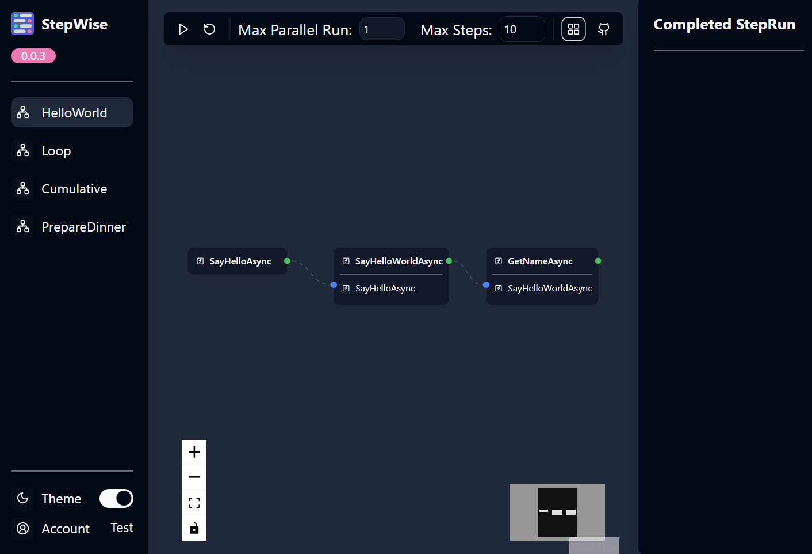

<a name="readme-top"></a>


<div align="center">


# StepWise

[](https://badge.fury.io/nu/LittleLittleCloud.StepWise)

</div>

StepWise is a workflow engine build with C# and typescript. In StepWise, you define a workflow in C#, and visualize and execute it in StepWise UI.

### Features
- Code-first workflow definition
- Visualize and execute workflow in StepWise UI


# [UI](#tab/ui)

# [Code](#tab/code)
```csharp
public class HelloWorld
{
    [Step]
    public async Task<string> SayHelloAsync()
    {
        return $"Hello";
    }

    [Step]
    [DependOn(nameof(SayHelloAsync))]
    public async Task<string> SayHelloWorldAsync([FromStep(nameof(SayHelloAsync))] string hello)
    {
        return $"{hello} World!";
    }

    [Step]
    [DependOn(nameof(SayHelloWorldAsync))]
    public async Task<string> GetNameAsync(
        [FromStep(nameof(SayHelloWorldAsync))] string helloWorld,
        string name = "LittleLittleCloud")
    {
        return $"{helloWorld}, {name}";
    }
}
```
---

### Installation
To use StepWise, you can install the LittleLittleCloud.StepWise package from NuGet.org.

```bash
dotnet add package LittleLittleCloud.StepWise
```

### Example
You can find more examples in the [example](https://github.com/LittleLittleCloud/StepWise/tree/main/example) folder.